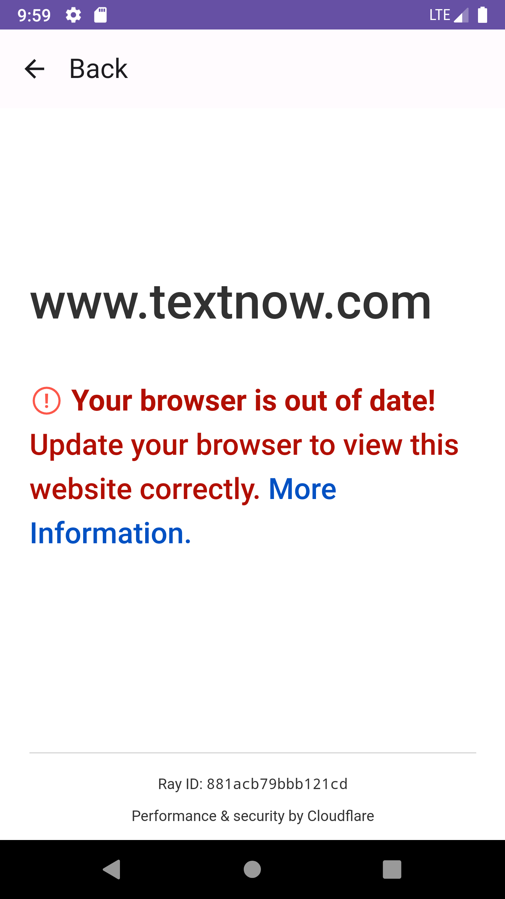

# Hacker News App

 

## Description
This application, entirely written in Kotlin using Jetpack Compose, provides an interface for viewing posts of the "Hacker News" website. The architecture used is MVVM and Repository with the support of Android's Architecture Components.

### Jetpack Compose
Jetpack Compose was chosen as the primary UI framework due to its declarative nature and ability to simplify UI development. It provides a concise and efficient syntax for building modern and appealing user interfaces.

### Layers
The architecture follows the principles of Clean Architecture, clearly separating the presentation, domain, and data layers. This facilitates maintenance, scalability, and testing of each layer separately.

- **Presentation Layer (UI):** Implemented with Jetpack Compose. This is where presentation logic and user interactions reside.

- **Domain Layer:** Contains business logic and business rules. It is independent of the concrete framework implementation.

- **Data Layer:** Manages data access, whether from a remote API, local database, or any other data source.

### Android Architecture Components
The Android Architecture Components are used to provide an organizational structure and a set of tools for developing robust and maintainable applications. LiveData and ViewModel are employed to handle UI lifecycle and data management efficiently.

## Project Structure
- **ui:** All Jetpack Compose composables and reusable components.

- **presentation:** Contains the implementation of the presentation layer logic.

- **domain:** Contains the business logic and business rules of the application.

- **data:** Manages data access, including repository implementations, services, and data sources.

- **di:** Contains the dependency injection setup using Dagger Hilt.

## Feature: Delete Posts (Not Yet Implemented)
The ability to delete posts has not been implemented in the current version of the application. While this feature is not available at the moment, we have left placeholders and prepared the codebase for its future implementation.

### Why Hasn't it Been Implemented?
The deletion feature is an essential part of managing user-generated content. However, due to time constraints or prioritization of other features, we have not implemented it in the current release.

### Future Implementation
We recognize the importance of allowing users to delete their posts and plan to implement this feature in a future update. The necessary infrastructure, such as UI components and backend logic, has been laid out, making it easier to integrate the deletion functionality when the time comes.

## Run the Project

This project uses Android Studio as the integrated development environment (IDE). Follow these steps to run the project on your local machine:

### Prerequisites
- Android Studio installed on your system.
- Internet connection to download dependencies.

### Steps to Run
1. **Clone the Repository:**

```bash
git clone https://github.com/eugenio1590/hacker-news.git
```
2. **Open the Project in Android Studio:** Open Android Studio and select the option "Open an Existing Project". Navigate to the location where you cloned the repository and select the project folder (hacker-news).

3. **Wait for Android Studio to Configure the Project:** Android Studio may perform some initial setup tasks and download necessary dependencies. Wait for this process to complete before proceeding.

4. **Connect a Device or Create an Emulator:** Connect an Android device to your computer via USB or set up an emulator in Android Studio.

5. **Run the Project:** Click on the "Run" button in Android Studio or press Shift + F10 to launch the application on your device or emulator.

That's it! You should now have the Android project running on your local machine.
